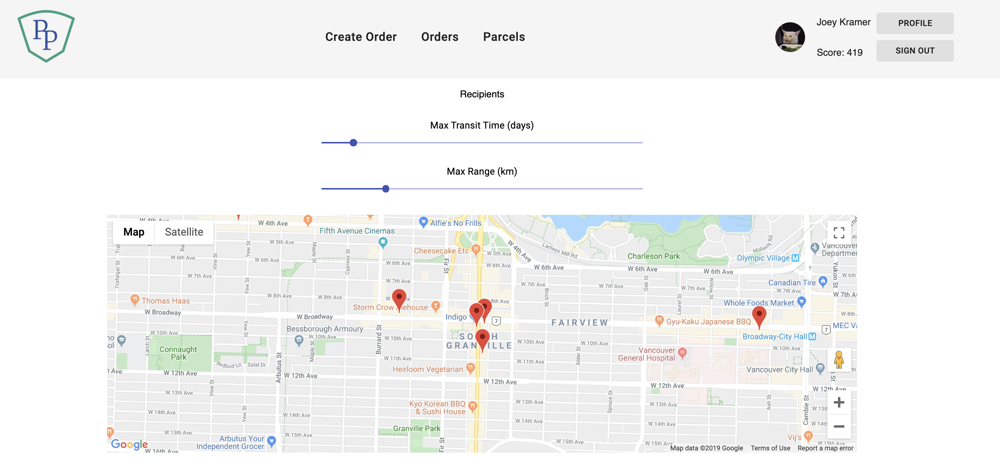
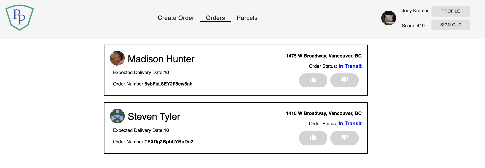

# ParcelPocket

Parcel Pocket is a platform which brings together

- users ordering online products but unable to receive the package at the time of deliverly
  and
- recipients who are able to available to receive the parcel and pass it to the owner

## Technologies Used

- Meteor
- React
- Google Maps API
- Google Geolocation
- Final Form
- React Router
- NPM
- Mongo Database
- Bcrypt
- Dotenv

## Installation Instructions

### Available Scripts

In the project directory, you can run:>

### 'yarn install'

Will install all dependencies required for the app.

### `yarn start`

Runs the app in the development mode. 
Open [http://localhost:3000](http://localhost:3000) to view it in the browser.

The page will reload if you make edits. 
You will also see any lint errors in the console.

### `yarn test`

Launches the test runner in the interactive watch mode. 
See the section about [running tests](https://facebook.github.io/create-react-app/docs/running-tests) for more information.

## User Interface

The main page of the app is the create orders page. Users can create orders which will be shipped to a recipient.

This is where the user tracks all of orders they have created in the past.
